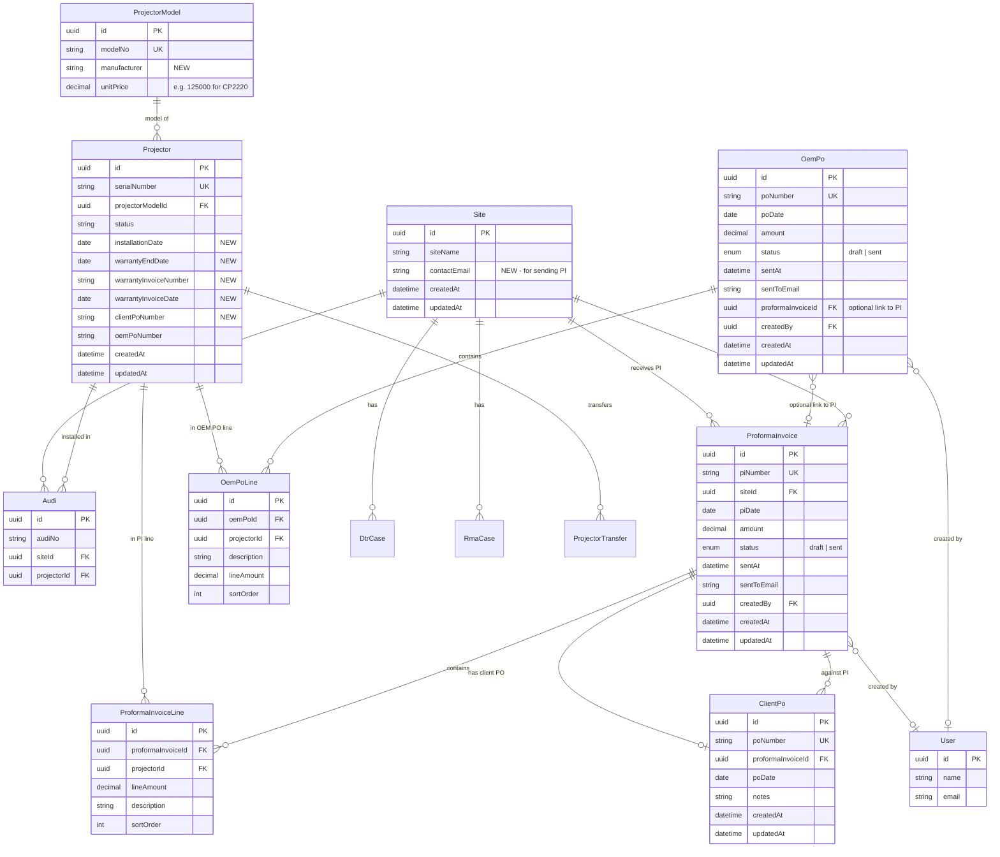

# PI / PO & Warranty — Schema Flowchart

This document defines the **schema** (entities and relationships) for Proforma Invoice (PI), Purchase Order (PO), and Warranty/AMC flows.

---

## 1. Entity relationship diagram (schema overview)

---

## 2. Flow: Warranty/AMC → PI → Client PO → OEM PO

---

## 3. Schema summary (what to add)

| Area | Change |
|------|--------|
| **Site** | Add `contactEmail` (String?, for sending PI) |
| **ProjectorModel** | Add `unitPrice` (Decimal?, e.g. 125000 for CP2220 — price per unit for this model; used to default PI/PO line amounts) |
| **Projector** | Add `warrantyEndDate` (DateTime?), `warrantyInvoiceNumber` (String?), `warrantyInvoiceDate` (DateTime?), `clientPoNumber` (String?), `oemPoNumber` (String?) |
| **New: ProformaInvoice** | id, piNumber, siteId, piDate, amount, status (draft/sent), sentAt, sentToEmail, createdBy, timestamps |
| **New: ProformaInvoiceLine** | id, proformaInvoiceId, projectorId, lineAmount, description, sortOrder |
| **New: ClientPo** | id, poNumber, proformaInvoiceId, poDate, notes, timestamps |
| **New: OemPo** | id, poNumber, poDate, amount, status (draft/sent), sentAt, sentToEmail, proformaInvoiceId (optional), createdBy, timestamps |
| **New: OemPoLine** | id, oemPoId, projectorId, description, lineAmount, sortOrder |

---

## 4. Config (outside schema)

- **OEM recipient email**: e.g. `OEM_EMAIL` in env or a small `Settings` / config table (key-value for `oem_po_recipient_email`).

---

## 5. Model price → PI/PO line amount

- **ProjectorModel.unitPrice** is the default price per unit for that model (e.g. CP2220 = 1,25,000). Store as decimal (e.g. `125000`); display with locale formatting (e.g. 1,25,000).
- When adding a **ProformaInvoiceLine** or **OemPoLine** for a projector, default **lineAmount** from the projector’s **ProjectorModel.unitPrice**; user can override per line if needed.
- PI/PO document generation uses these line amounts to compute and show totals.

---

## 6. Optional: PI document template (reference)

- Stored as HTML template (file or DB); placeholders: `{{siteName}}`, `{{piNumber}}`, `{{piDate}}`, `{{lines}}`, `{{totalAmount}}`. Same idea for OEM PO template.

Use this flowchart as the single source of truth for the schema before implementing Phase 1 (Prisma changes + migration).
